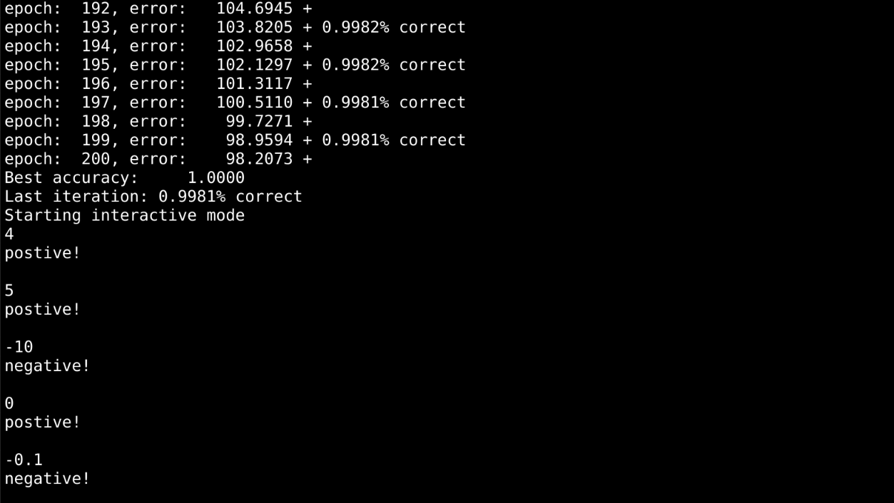

# Neural Network

`Network.java` implements a supervised back propogration deep neural network.
Full example usage can be found in `MNIST.java` and `Sandbox.java`. The Apache
Math Commons 3.6.1 jar is required and can be found 
[here](http://commons.apache.org/proper/commons-math/download_math.cgi) from the Apache Math Commons website or you get just the jar [here](https://public.anardil.net/Projects/Neural-Network/commons-math3-3.6.1.jar) from anardil.net.

## Quick Start for Linux
  1. `git clone https://github.com/Gandalf-/Neural-Network.git`
  2. `cd Neural-Network`
  3. `wget https://public.anardil.net/Projects/Neural-Network/commons-math3-3.6.1.jar`
  4. `make`
  5. `java -cp .:commons-math3.6.1.jar Sandbox`
  6. Done!

## Features
- Data is encapsulated in the Data class, from `Data.java`.  Compatible MNIST
  CSV data can be found [here](https://public.anardil.net/Projects/Neural-Network/data)

- Network descriptions are single dimensional arrays, where the value at each
  index denotes the number of nodes in that layer. For MNIST, the description
  looks like this: `int description[] = { 28 * 28, 15, 10 };`  Which describes
  a network with 28 * 28 nodes in the input layer, one hidden layer with 15
  nodes, and an output layer with 10 nodes. One output node for each possible
  prediction, the numbers 0-9.

- With a network description, training is easy
```
  int description[] = { 28 * 28, 15, 10 };
  NeuralNetwork network = new NeuralNetwork(description);

  network.train(
    training_data, tolerance, max_epochs, learn_speed);
  
  System.out.print("Last iteration: ");
  network.get_accuracy(test_data);
```

- Models can be saved to and loaded from CSV files, allowing you to keep
  training later or save models for comparision later. Trained models are
  provided in the `/models` folder.
```
  NeuralNetwork network = new NeuralNetwork("models/sandbox.csv");
  network.train(training_data, tolerance, max_epochs, speed);

  network.get_accuracy(training_data);
  network.print_csv("models/sandbox.csv");
```


## Example output
- Model that predicts if a number is positive or negative, from `Sandbox.java`.


